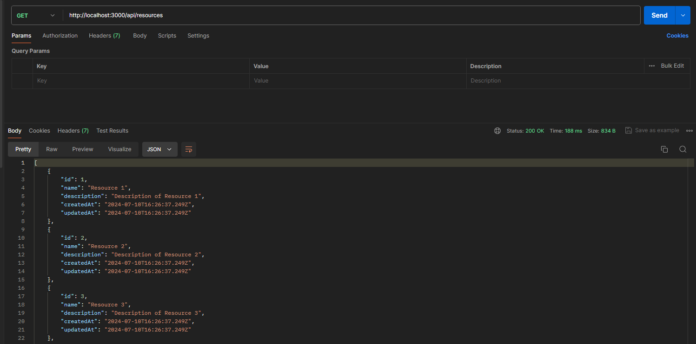
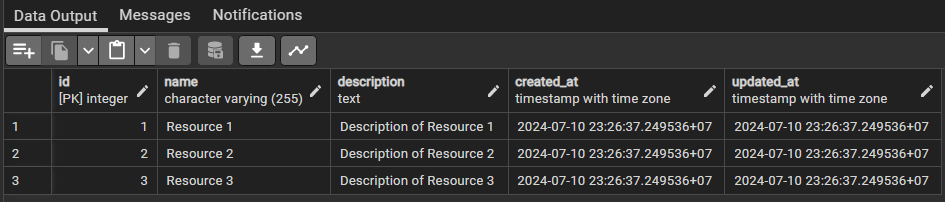
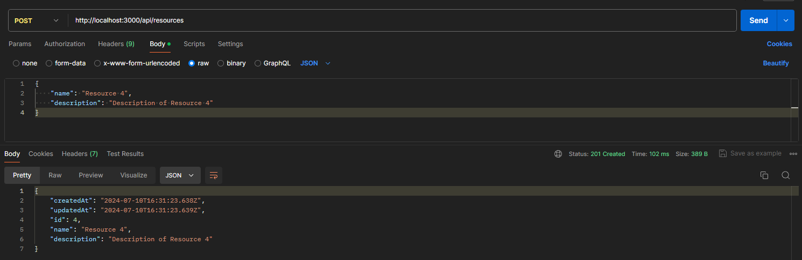
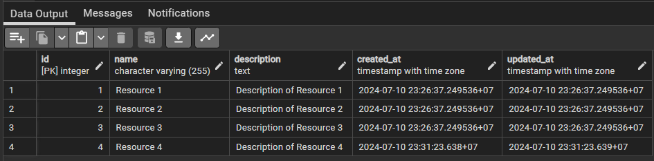
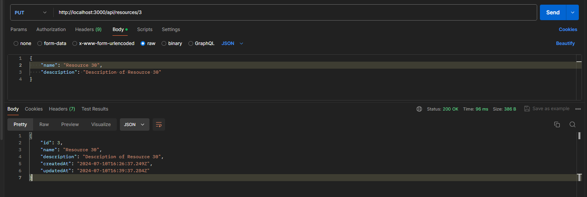
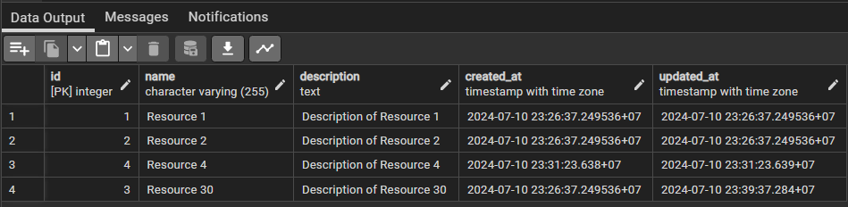
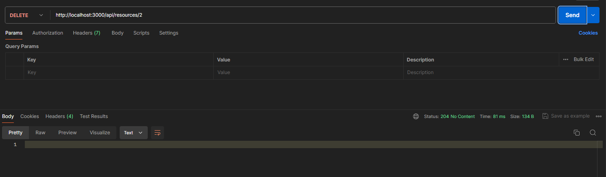
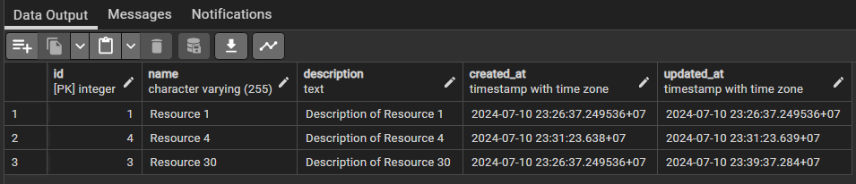

# Problem 5: A Crude Server

## I have developed a set of **CRUD interfaces** enabling users to interact with the service. The database for storing resources is **PostgreSQL**, and I use **Sequelize ORM** to simplify database operations, allowing developers to work with JavaScript objects instead of raw SQL queries.

- Programming language: TypeScript
- Framework: ExpressJS
- Database: PostgreSQL
- ORM: Sequelize

## Run this app:

- Step 1: Clone this source code
- Step 2: Input the database name, username, password, and other relevant details into the .env file. Use local.env for suggestions on environment variables.
- Step 3: Run npm run start to start the application, or npm run build to start with nodemon.

```
npm run start
npm run build
```

### List resources with basic filters

- HTTP method: GET
- URL: http://localhost:3000/api/resources
- Result:
  
  

### Create a resource

- HTTP method: POST
- URL: http://localhost:3000/api/resources
- Sample request payload

```
{
  "name": "Resource 4",
  "description": "Description of Resource 4"
}
```

- Result:
  
  

### Get details of a resource

- HTTP method: GET
- URL: http://localhost:3000/api/resources/:id
- Result:
  

### Update resource details

- HTTP method: PUT
- URL: http://localhost:3000/api/resources/:id
- Result:
  
  

### Delete a resource

- HTTP method: DELETE
- URL: http://localhost:3000/api/resources/:id
- Result
  
  
