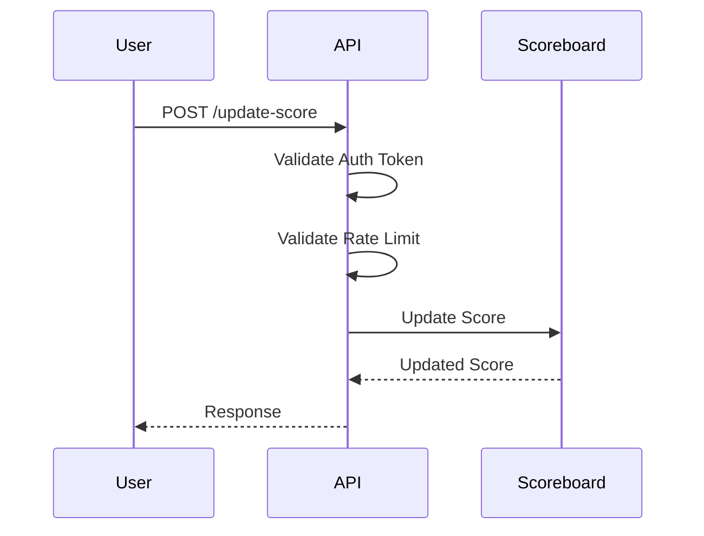
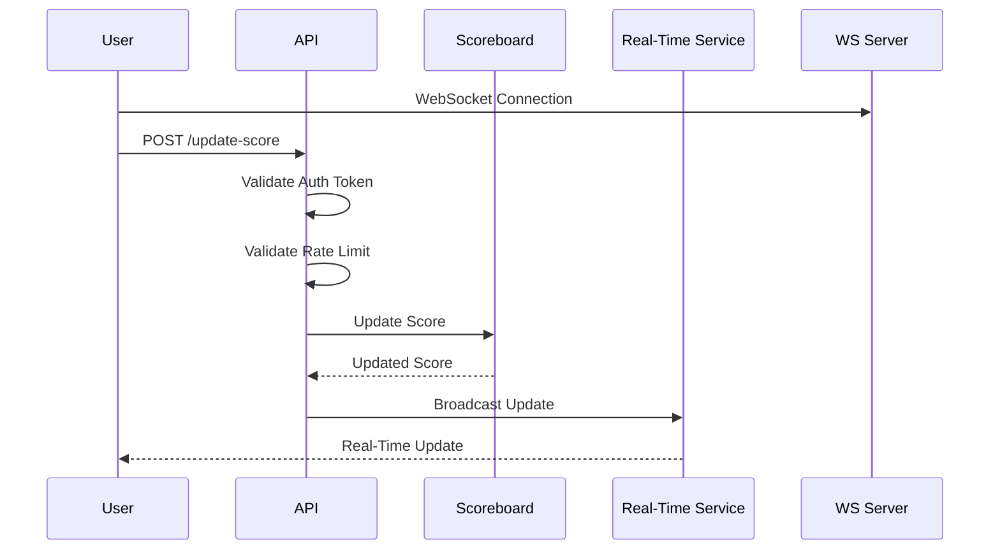

# Score Board API Module

## Overview

This module provides API endpoints to manage and update user scores for a live, real-time scoreboard on a website.

It is designed to handle score updates securely and efficiently, ensuring that only valid and authorized score submissions are accepted and reflected on the scoreboard.

## Features

- **Live Score Updates:** Reflects changes in real-time on the user's scoreboard.
- **Secure Score Submission:** Implements authentication and validation to prevent unauthorized score manipulations.

## API Endpoints

### POST `/update-score`

This endpoint is used to update the score of a user after an action is completed.

#### Headers

- `Authorization`: `Bearer <authToken>`

#### Request Body

```json
{
  "userId": "string",
  "scoreIncrement": "integer"
}
```

---

#### Response

```json
{
  "success": "boolean",
  "message": "string",
  "newScore": "integer"
}
```

## Security Measures

- **Authentication Token**: Each request must include a valid `authToken` that is verified before processing the score update.
- **Rate Limiting**: Prevents abuse by limiting the frequency of score updates per user.

## Future Improvements

- Implement WebSocket for true real-time updates without needing to refresh the client.
- Enhance security with more robust authentication mechanisms.

## Usage

To update a user's score, make a POST request to `/update-score` with the required parameters.

### Example Request

```http
POST /update-score HTTP/1.1
Host: api.example.com
Authorization: Bearer <auth>
Content-Type: application/json

{
  "userId": "user123",
  "scoreIncrement": 10
}
```

## Diagram to Illustrate the Flow of Execution

Here's a sample flow diagram:



### Additional Technical Enhancements

#### Use of WebSockets or Server-Sent Events (SSE):

- **WebSockets**: Ideal for two-way communication between the client and server. This would allow the server to push score updates to all connected clients immediately when a change occurs, ensuring the scoreboard is updated in real-time.
- **Server-Sent Events (SSE)**: Best suited for one-way communication from the server to the client. It's simpler to implement on the client side compared to WebSockets and uses standard HTTP. This could be an excellent choice for pushing updates to the client without needing a full two-way communication protocol.

#### Real-time Data Processing:

Integrate a real-time data processing service or middleware like Redis Pub/Sub, RabbitMQ, or Apache Kafka.
These systems can handle high-throughput and low-latency messaging, which is critical for a live scoreboard.

#### Enhanced Security Measures:

- Use OAuth 2.0 with scopes for finer access control.
- Implement JWT (JSON Web Tokens) for stateless authentication.
- Consider using API gateways for throttling and safeguarding against DDoS attacks.

#### Scalability:

- Use container orchestration technologies like Kubernetes to manage the application's deployment, scaling, and management seamlessly.
- Implement a CDN for static assets if the scoreboard includes elements like user avatars or other media.

### Revised Diagram with Real-Time Updates

To illustrate the integration of real-time updates, here's a revised diagram:


